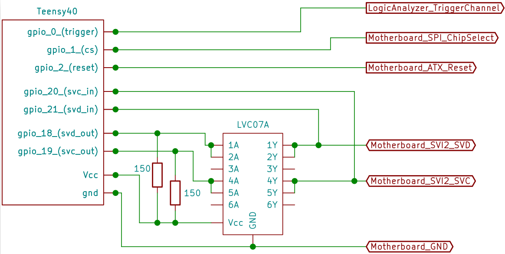

# AMD-SP Voltage Fault Injection Attacks 

In this folder we make the voltage fault injection code available and describe how to use it to mount an attack.

## Hardware setup

Our glitching setup consists of the following components:

- [Teensy 4.0 µController](https://www.pjrc.com/store/teensy40.html) - for injecting packets into the SVI2 bus
- Controlling PC - standard PC that controls the Teensy via a USB interface
- Target system - see Tables below
- EM100 flash emulator - for deploying our payloads
- Salae Logic Analyzer - for debugging and data-exfiltration

Alternatively to the EM100 flash emulator, a simple flash programmer can also be used to deploy the payloads. A good overview of cheap programmers can be found [here](https://github.com/boseji/CH341-Store).
A Logic Analyzer could be replaced with an Oscilloscope, or possibly the Teensy µController itself, but for convenience it is recommended.

The different components need to be connected as depicted here:


In order to inject packets onto the SVI2 bus wires need to be soldered onto the motherboards SVC and SVD lines (close to the VR).
These lines are driven with an open-drain driver (like the LVC07A).
On some motherboards it was necessary to connect multiple of the LVC07A outputs in parallel to archive successful packet injections.

These drivers are controlled by an I²C interface of the Teensy µController.
Both the SVC and SVD lines are also directly connected to two pins of the µController, so that it can listen in on the bus and avoid collisions with other packets.

Fully connected, the teensy should look as follows:


## Targets

The targets we sucessfully attacked are:

##### Ryzen

| Motherboard | CPU   | Microarchitecture |
|:-----------:|:-----:|:-----------------:|
| ASUS PRIME X370-PRO | Ryzen 7 1700X | Zen 1 |
| ASUS PRIME X370-PRO | Ryzen  5 2600 | Zen+ |
| ASRock A520M-HVS | Ryzen 5 3500 | Zen 2 |
| ASRock A520M-HVS | Ryzen 5 5600X | Zen 3 |

##### Epyc

| Motherboard | CPU   | Microarchitecture |
|:-----------:|:-----:|:-----------------:|
| Supermicro H11DSU-iN | Epyc 7281 | Zen 1 |
| Supermicro H11DSU-iN | Epyc 7272 | Zen 2 |
| Supermicro H11DSU-iN | Epyc 72F3 | Zen 3 |

Note: The H11DSU-iN does not officially support Zen 3 CPUs, however, we could nevertheless boot the AMD-SP and execute our payloads.

## Teensy Firmware

A custom attack-firmware is necessary for our attack.
Its code lies in the [teensy_firmware](./teensy_firmware) directory (sorry for the C++/C mix).

The attack firmware is available as a prebuilt blob here: [teensy_firmware.hex](./teensy_firmware.hex), or can be compiled [as described here](#compiling-the-teensy-firmware).

### Installing the Firmware

You will need to compile a tool for flashing the built firmware to the teensy.
To do this check out `https://github.com/PaulStoffregen/teensy_loader_cli.git` under `teensy_tool`:
```
git clone https://github.com/PaulStoffregen/teensy_loader_cli.git teensy_tool
```
Then install `libusb-dev` (process might differ for other operating systems):
```
apt install libusb-dev
```
And compile the tool:
```
cd teensy_tool && make
```

With this tool built and the Teensy 4.0 connected you can use the following command to flash the firmware onto the µController:
```
./teensy_tool/teensy_loader_cli --mcu=TEENSY40 -s -w teensy_firmware.hex
```

### Using the teensy firmware

Connect to the teensys usb-serial port.

The teensy firmware includes a documentation feature that is available through the serial port

```
> help

## set/reset/print ###################################################
 ...
```

The complete documentation is available [here: teensy_cli.txt](./teensy_cli.txt).

The Teenys interface can be used to dial in attack parameters and to carry out voltage fault attacks.
Additionally we provide some python scripts to interface with the Teensy.
A detailed documentation of the whole process can be found [here: ParameterDetermination.md](ParameterDetermination.md).

### Compiling the teensy firmware

For the compilation process you need to install arduino with the teensyduino setup as described [here](https://www.pjrc.com/teensy/td_download.html).

**Note:** It should also be possible to get around using arduino by using [this repo](https://github.com/PaulStoffregen/cores/), but I had issues with a library not being found by ubuntus (18.04) `arm-none-eabi` toolchain.

Then you need to set the environment variable `ARDUINO_PATH` to point to your installation of arduino.

**Note:** You need to patch the file `$ARDUINO_PATH/hardware/teensy/avr/cores/teensy4/imxrt.h` due to [this error](https://github.com/PaulStoffregen/cores/pull/533).

You can use the following command for this:
```
$ patch -lu $(ARDUINO_PATH)/hardware/teensy/avr/cores/teensy4/imxrt.h <<EOF
--- imxrt.h
+++ imxrt.h
@@ -6445,11 +6445,10 @@
        volatile uint32_t SAMR;                 // 140
        volatile uint32_t unused11[3];
        volatile uint32_t SASR;                 // 150
-       volatile uint32_t unused12[3];
        volatile uint32_t STAR;                 // 154
-       volatile uint32_t unused13[3];
+       volatile uint32_t unused12[2];
        volatile uint32_t STDR;                 // 160
-       volatile uint32_t unused14[3];
+       volatile uint32_t unused13[3];
        volatile uint32_t SRDR;                 // 170
 } IMXRT_LPI2C_t;
 #define IMXRT_LPI2C1           (*(IMXRT_LPI2C_t *)0x403F0000)
EOF
```

Additionally you will need the teensy tool installed [as described here](#installing-the-firmware) to flash the Teensy 4.0 µController.
In the `teensy_firmware` directory you can build the firmware by running `make` and you can flash the firware to a connected Teensy by running:
```
make program
```

